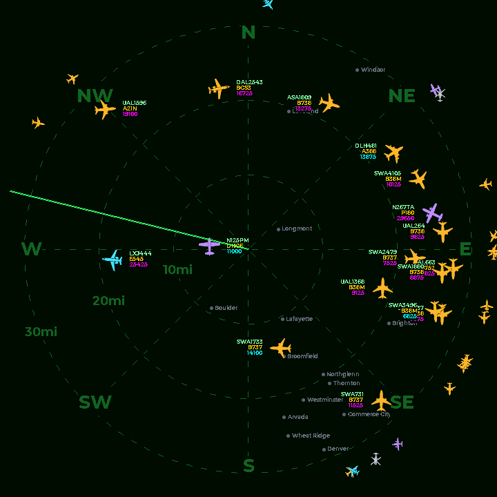

# FlightScnr P4 — live ADS-B radar on a 3.4″ round display

Firmware for a desk radar scope: live ADS-B traffic sweeping around your position, drawn like a real
PPI radar — blips paint in as the sweep arm passes them, and hold their position until it comes round
again.

This is a **port of [FlightScnr](https://github.com/yashmulgaonkar/FlightScnr) by
[yashmulgaonkar](https://github.com/yashmulgaonkar)** to the **Waveshare ESP32-P4 3.4C** round touch
display, rebuilt for its native 720×720 panel rather than the original 390×390 AMOLED. See
[Credits](#credits) for the full lineage and [License](#license) for the terms it inherits.

<p align="center">
  
</p>

*(Captured from a running board with `tools/device_screenshot.py` — this is the actual 720×720
framebuffer, not a mock-up.)*

## Features

- **PPI sweep** — the sweep arm paints traffic the way a real radar does: each aircraft's position,
  heading and tag update only as the beam crosses its bearing, then stay put until the next pass.
  One rotation is 6 s; the display refreshes at ~30 fps.
- **Radar scope** — swipe left/right to zoom through 5/10/20/30 mi (default 20 mi ≈ 32 km), compass rose,
  optional sweep line, five accent colors, rim markers for traffic beyond the outer ring.
- **Aircraft icons** — top-down silhouettes per ICAO type (20 shapes, 406 type mappings), rotated to
  heading and antialiased from 96×96 coverage masks, color-coded by what the aircraft is:

  | Color | Aircraft |
  | --- | --- |
  | **Amber** | Commercial jets — airliners, regional jets, freighters |
  | **Cyan** | Private / business jets |
  | **Violet** | Propeller and turboprop |
  | **Slate** | Rotorcraft, military, gliders, drones, unknown |

  Alert traffic (military, emergency squawk) overrides the body color with its orange/red pulse.
- **Aircraft tags** — callsign, ICAO type and altitude beside every aircraft on the scope, in 4 pt
  type so labels fit without hiding the picture. Altitude is always feet; cyan means level or
  climbing, magenta descending.
- **Map underlay** — a dim shaded-relief map sits beneath the grid: hypsometric terrain with
  hillshading, named lakes and reservoirs, rivers, and major roads, plus town names. Everything stays
  well below the instrument in brightness — the mountains rise to one side, the plains stretch out on
  the other, and a glance orients the traffic. Town labels are placed most-populous first, dropped
  where they would collide, and capped so a wide range over a metro does not bury the scope. Toggle
  it on the web page ("Show map underlay").
- **Traffic source** — [adsb.fi](https://adsb.fi) by default (~2 s poll, up to 64 aircraft), or point
  it at a **local receiver** (readsb / tar1090 `aircraft.json`) over plain LAN HTTP to skip the
  internet entirely.
- **Alerts** — military and emergency-squawk traffic pulse in orange/red; optional watch list by
  callsign; optionally hide everything else.
- **Flight detail** — tap a blip for callsign, airline logo and name, route, ICAO type, altitude and
  speed. Route/airline lookup is optional (see [Optional APIs](#optional-apis)).
- **Clock & forecast** — NTP time and date, current conditions, sunrise/sunset, and a 3-day forecast.
  Automatic timezone and DST from your radar center via [timeapi.io](https://timeapi.io) (no key).
- **Auto-idle clock** — an empty scope falls back to the clock and returns when traffic appears.
- **Imperial by default** — feet, mph, °F, statute-mile rings. Metric and nautical are one setting away.
- **Web + on-device settings** — full configuration at `http://flightscnr.local/`, applied live
  without a reboot, plus three on-device pages. Up to 3 saved Wi-Fi networks with ordered failover.

## Hardware

| Item | Details |
| --- | --- |
| **Board** | [Waveshare ESP32-P4-WIFI6-Touch-LCD-3.4C](https://www.waveshare.com/product/esp32-p4-wifi6-touch-lcd-3.4c.htm) — ESP32-P4, 32 MB flash, 32 MB PSRAM |
| **Display** | 3.4″ round MIPI-DSI, JD9365 driver. Sold as 800×800; the fitted panel behaves as **720×720** (a center band is dropped if fed 800×800), so the UI is built for 720×720 |
| **Touch** | GT911 capacitive — **touch only**, no rotary encoder or knob (unlike the original board) |
| **Wi-Fi** | On-board ESP32-C6 over SDIO (ESP-Hosted); the P4 has no radio of its own |

## Build & flash

Requires [PlatformIO](https://platformio.org/) with the
[pioarduino](https://github.com/pioarduino/platform-espressif32) ESP32-P4 platform (pinned in
`platformio.ini`; the official espressif32 platform has no P4 support).

```bash
pio run -e waveshare-p4-34c -t upload
pio run -e waveshare-p4-34c -t upload --upload-port COM5   # explicit port
```

On **Windows**, prefix with `PYTHONIOENCODING=utf-8 PYTHONUTF8=1` — otherwise the upload dies partway
through with a cp1252 `UnicodeEncodeError` on esptool's progress bar and then hangs.

```bash
PYTHONIOENCODING=utf-8 PYTHONUTF8=1 pio run -e waveshare-p4-34c -t upload
```

Builds auto-download the [tar1090-db](https://github.com/wiedehopf/tar1090-db) aircraft-type database
and the [Airports](https://github.com/mwgg/Airports) list, then generate headers into `include/`.

> `docs/` holds the upstream WebFlasher page, which targets the original LilyGO board and is not
> maintained here — build with PlatformIO for this port.

## Setup

1. Power on and join the **FlightScnr-AP** Wi-Fi network when prompted.
2. Open <http://4.3.2.1> (or `http://flightscnr.local`), enter your Wi-Fi credentials, and reboot.
3. Set your **radar center** (the position the scope sweeps around) at `http://flightscnr.local/`,
   along with range, units, accent color and any optional API keys. **Save** applies immediately.

Up to 3 networks can be saved; slot order is preference order. A network that fails repeatedly is
skipped for the rest of that session without deleting its credentials, and if Wi-Fi stays down the
setup portal reopens with your networks intact.

## Navigation

Touch only — this board has no knob.

| From | Gesture | Goes to |
| --- | --- | --- |
| Radar | tap a blip | that aircraft's flight detail |
| Radar | swipe ← / → | **zoom the scope**: 5 / 10 / 20 / 30 mi |
| Radar | swipe ↑ | settings |
| Radar | swipe ↓ | clock |
| Clock | swipe ↑ / → / ← | radar / forecast / clock settings |
| Forecast | swipe ↑ / ← | radar / clock |
| Flight detail | swipe ↓ or → | back to radar |
| Settings | swipe ← / → | next page / back (last page continues to About) |
| Radar | **hold ~3.5 s** | Wi-Fi setup portal — see below |

**Zoom** — swipe left to come in, right to go out, through four range steps:

| Range | Rings | Coverage |
| --- | --- | --- |
| 5 mi | 2 / 3 / 5 mi | 8 km |
| 10 mi | 3 / 7 / 10 mi | 16 km |
| 20 mi | 7 / 13 / 20 mi | 32 km |
| 30 mi | 10 / 20 / 30 mi | 48 km |

The ladder clamps at both ends rather than wrapping. The settings pages and web form still expose the
full preset list (2–30 mi) for anything in between; a range set off the ladder moves to the next step
in whichever direction you swipe. Note the firmware tracks at most 64 aircraft, so over a busy metro
the widest step can hit that ceiling and drop traffic.

Screens auto-return to the radar on a configurable timeout.

### Joining a different Wi-Fi

The web settings page only helps while the radar is already on your network. If that network is gone —
new router, new password, away from home — **hold the radar screen for about 3.5 seconds**. The device
raises its own access point and shows what to do:

1. Join **FlightScnr-AP** from a phone or laptop.
2. Open <http://4.3.2.1> (or `http://flightscnr.local`), pick a network from the scan list, enter the
   password, and save.

Saved networks are **kept** — the new one is added alongside them (up to 3, in preference order), so
this is also how you add a second network without losing the first. The radar pauses while the portal
is open and reboots onto the new network once configured. If nothing connects within 5 minutes the
portal gives up and the radar reconnects on its own, so an accidental hold cannot strand the device.

Holding only works from the radar screen, and a swipe or a brief tap will not trigger it.

## Optional APIs

Everything below is optional — the radar itself needs no keys.

| Service | Purpose | Sign-up |
| --- | --- | --- |
| [Tomorrow.io](https://app.tomorrow.io/signup?planid=60d46beae90c3b3549a59ff3) | Weather and 3-day forecast | free tier |
| [AirLabs](https://airlabs.co/signup) | Route + airline lookup (first choice) | free tier |
| [FlightAware AeroAPI](https://www.flightaware.com/aeroapi/signup/personal) | Route lookup (second) | paid per call |
| [FR24](https://fr24api.flightradar24.com/docs/getting-started) | Route lookup (third) | paid per call |

Providers are tried in that order, each with per-key monthly limits and spend counters that reset on
the calendar month. One live call per uncached callsign on first flight-detail open; results are
cached in RAM and flash (`/route_cache.csv`, up to 1500 rows, downloadable from the web portal), and
cached callsigns never count against a limit.

## Device tools

Helpers in `tools/` for checking changes on real hardware — standard library only unless noted.
Replace `flightscnr.local` with the device IP if mDNS is unavailable.

```bash
# Save the live framebuffer as a PNG (GET /screenshot returns an RGB565 BMP)
python tools/device_screenshot.py flightscnr.local radar.png

# Inspect or change settings without clobbering the rest of the form
python tools/device_settings.py flightscnr.local --dry-run
python tools/device_settings.py flightscnr.local range_mi=32km dist_unit=mi

# Preview a generated GFXfont header as ASCII art before trusting it on glass
python tools/preview_gfxfont.py include/fonts/MontserratBold4pt7b.h "N735RB 12,500ft"

# Timestamped serial capture that does not reset the board (needs pyserial)
~/.platformio/penv/Scripts/python.exe tools/serial_capture.py 60 > run.log
```

`device_settings.py` exists because `POST /save` applies the entire settings form at once, so a
partial post silently clears whatever it omits. It re-sends every current value and overrides only
the fields you name; API keys are never sent, since the firmware treats an empty key as "keep".

`serial_capture.py` clears DTR/RTS so attaching does not reboot the chip, and timestamps every line —
that is what makes pacing measurable: consecutive `[sweep] reveal ang=A->B` lines give the true sweep
rate, and gaps between lines expose loop stalls.

Font headers are generated with `tools/ttf_to_gfxfont.py` (needs `pip install freetype-py`).

The map underlay ships as **regional** extracts — the radar never draws past 30 mi, so worldwide
data would be wasted flash. The committed headers cover the maintainer's area; regenerate them for
yours (downloads are cached next to the tools):

```bash
python tools/generate_towns.py --center 40.13,-105.18 --radius-km 400
python tools/generate_towns.py --min-pop 5000            # fewer, larger towns
python tools/generate_map.py   --center 40.13,-105.18    # terrain, water, roads
```

With no `--center`, `generate_towns.py` uses `config::kFactoryLatitude/Longitude` and
`generate_map.py` reuses the committed towns anchor. Both blur the center to 0.1° before it is
written into the tree. A radar center outside the extracts simply draws a plain scope.
`generate_map.py` pulls elevation from AWS Terrain Tiles and roads/water from the Overpass API; the
hypsometric color ramp in `src/ui/map_underlay.cpp` (`kHypsoStops`) is tuned for Front Range
elevations — adjust the stops if your region lives at very different altitudes.

## Differences from upstream FlightScnr

For anyone coming from the original project:

- **Board and resolution** — Waveshare ESP32-P4 3.4C at native 720×720, replacing the LilyGO
  T-Encoder Pro's 390×390 AMOLED. Layout is designed for the larger glass (hairline rings, 64×64
  aircraft icons) instead of scaling a smartwatch-sized design up.
- **Touch only** — no rotary encoder on this board, so knob interactions were replaced by gestures.
- **PPI sweep reveal** — aircraft update under the sweep arm per target rather than the whole screen
  jumping on each ADS-B poll.
- **Tag rendering** — 4 pt tags on every aircraft on the scope, instead of larger tags limited to the
  few nearest the center.
- **Local receiver source** — optional readsb / tar1090 `aircraft.json` feed over LAN.
- **Imperial defaults** — feet, mph, °F, 20 mi rings.
- **Wi-Fi** — ESP-Hosted over SDIO to the on-board C6, which makes internal DMA-capable RAM the
  scarce resource on this port; several buffers live in PSRAM specifically to keep the SDIO RX pool fed.

## Credits

This project stands on other people's work.

**Original project** — [**FlightScnr**](https://github.com/yashmulgaonkar/FlightScnr) by
[yashmulgaonkar](https://github.com/yashmulgaonkar). The application design, web settings portal,
radar concept, alerting, route-lookup waterfall and most of the service layer originate there; this
repository is a hardware port of it. If you enjoy this, support the original author:
[Buy Me a Coffee](https://buymeacoffee.com/yashmulgaonkar).

**Aircraft icon silhouettes** — from the FlightScnr Pi project by the same author; this repo commits
the generated coverage masks (`include/data/aircraft_icons_lookup.h`), while the source PNGs stay out
of the tree. Regenerate with `python tools/aircraft_icons_to_header.py` after dropping the PNGs into
`assets/aircraft_icons/`.

**FlightScnr's own inspirations** — [ESP32-Plane-Radar](https://github.com/MatixYo/ESP32-Plane-Radar)
by MatixYo and [deskradar](https://github.com/arvis91/deskradar) by arvis91.

**Data sources**

| Source | Used for |
| --- | --- |
| [adsb.fi](https://adsb.fi) | Live ADS-B traffic (community feed — please don't hammer it) |
| [tar1090-db](https://github.com/wiedehopf/tar1090-db) (wiedehopf) | Aircraft type and registration database |
| [Airports](https://github.com/mwgg/Airports) (mwgg) | Airport names and coordinates |
| [GeoNames](https://www.geonames.org/) cities1000 | Town names and coordinates for the map underlay (CC BY 4.0) |
| [AWS Terrain Tiles](https://registry.opendata.aws/terrain-tiles/) | Elevation for the shaded-relief underlay |
| [OpenStreetMap](https://www.openstreetmap.org/) via Overpass API | Roads, rivers and lakes for the map underlay (ODbL) |
| [timeapi.io](https://timeapi.io) | Timezone and DST from coordinates |
| [Tomorrow.io](https://www.tomorrow.io/) | Weather and forecast (optional) |
| [AirLabs](https://airlabs.co/), [FlightAware](https://www.flightaware.com/aeroapi/), [FR24](https://fr24api.flightradar24.com/) | Route and airline lookup (optional) |

**Libraries**

| Library | Author |
| --- | --- |
| [GFX Library for Arduino](https://github.com/moononournation/Arduino_GFX) | Moon On Our Nation (`lib/`) |
| [SensorLib](https://github.com/lewisxhe/SensorsLib) | Lewis He (`lib/`) |
| Driver Bus Library for Arduino | LILYGO_L (`lib/`) |
| Waveshare display drivers | Waveshare (`lib/`) |
| [ArduinoJson](https://github.com/bblanchon/ArduinoJson) | Benoît Blanchon |
| [WiFiManager](https://github.com/tzapu/WiFiManager) | tzapu |
| [AnimatedGIF](https://github.com/bitbank2/AnimatedGIF), [JPEGDEC](https://github.com/bitbank2/JPEGDEC) | Larry Bank |
| [pioarduino platform-espressif32](https://github.com/pioarduino/platform-espressif32) | pioarduino |
| [esptool-js](https://github.com/espressif/esptool-js) | Espressif (`docs/vendor/`) |

**Font** — [Montserrat](https://github.com/JulietaUla/Montserrat) by Julieta Ulanovsky and
contributors, under the [SIL Open Font License 1.1](https://openfontlicense.org/).

## License

**[CC BY-NC-SA 4.0](https://creativecommons.org/licenses/by-nc-sa/4.0/)** — see [LICENSE](LICENSE).

Inherited from the upstream project (© 2026 yashmulgaonkar) and kept here as required by its
ShareAlike term. Port changes are © 2026 Erik Salo under the same license.

- **Attribution** — credit the authors and link to the license when you share or adapt this.
- **NonCommercial** — no commercial use without separate permission from the original author.
- **ShareAlike** — adaptations must be released under this same license.

Vendored libraries in `lib/`, PlatformIO registry dependencies, bundled fonts and `docs/vendor/`
remain under **their own licenses** (MIT, BSD, Apache, GPL, OFL as applicable). Bundling them into a
firmware image does not relicense them — comply with each upstream license when distributing builds.

The 3D-printed enclosure from the original project is **not** part of this repository and is governed
by the Standard Digital File License on its
[MakerWorld page](https://makerworld.com/en/models/2902669-flightscnr-live-ads-b-traffic-sweeping-radar#profileId-3245055),
which prohibits redistribution and commercial use. That enclosure fits the original LilyGO board, not
this one. Read the license there before printing or sharing it.
